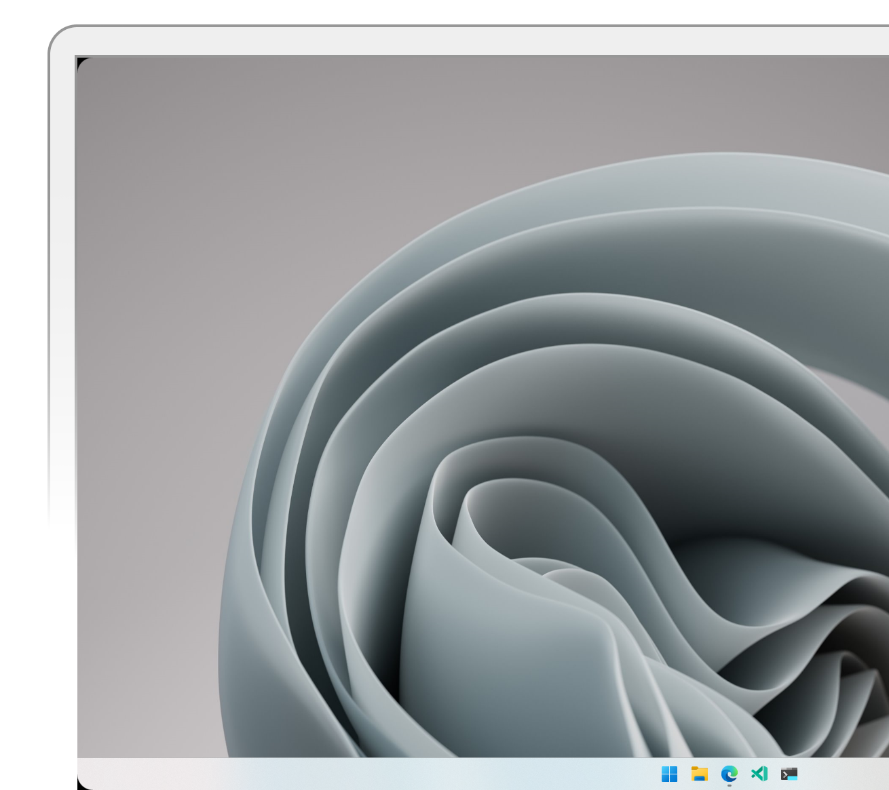

<table><tr><td colspan=4><h3 align=center><picture><source media="(prefers-color-scheme: dark)" srcset=https://raw.githubusercontent.com/RoundedCorners/Application/main/src-tauri/src/Image/32x32.png><source media="(prefers-color-scheme: light)" srcset=https://raw.githubusercontent.com/RoundedCorners/Application/main/src-tauri/src/Image/32x32.png></picture> Rounded Corners: </h3></td></tr><tr><td colspan=1 valign=top> <a href=https://github.com/RoundedCorners/Application target=_blank><picture><source media="(prefers-color-scheme: dark)" srcset="https://img.shields.io/github/stars/RoundedCorners/Application?label=stars&#38;logo=github&#38;color=black&#38;labelColor=black&#38;logoColor=white&#38;logoWidth=0&#38;logoColor=black"><source media="(prefers-color-scheme: light)" srcset="https://img.shields.io/github/stars/RoundedCorners/Application?label=stars&#38;logo=github&#38;color=white&#38;labelColor=white&#38;logoColor=black&#38;logoWidth=0&#38;logoColor=black"></picture></a> <a href=https://github.com/RoundedCorners/Application target=_blank><b>Application</b></a> <b>Rounds the corners of your Windows screen. </b> </td><td colspan=1 valign=top> <a href=https://github.com/RoundedCorners/Application target=_blank><picture><source media="(prefers-color-scheme: dark)" srcset="https://img.shields.io/github/last-commit/RoundedCorners/Application?label=Last%20Update&#38;color=black&#38;labelColor=black&#38;logoColor=white&#38;logoWidth=0"><source media="(prefers-color-scheme: light)" srcset="https://img.shields.io/github/last-commit/RoundedCorners/Application?label=Last%20Update&#38;color=white&#38;labelColor=white&#38;logoColor=black&#38;logoWidth=0"></picture></a> <a href=https://github.com/RoundedCorners/Application target=_blank><picture><source media="(prefers-color-scheme: dark)" srcset="https://img.shields.io/github/issues/RoundedCorners/Application?label=Issues&#38;color=black&#38;labelColor=black&#38;logoColor=white&#38;logoWidth=0"><source media="(prefers-color-scheme: light)" srcset="https://img.shields.io/github/issues/RoundedCorners/Application?label=Issues&#38;color=white&#38;labelColor=white&#38;logoColor=black&#38;logoWidth=0"></picture></a> <a href=https://github.com/RoundedCorners/Application target=_blank><picture><source media="(prefers-color-scheme: dark)" srcset="https://img.shields.io/github/downloads/RoundedCorners/Application/total?label=Leaks&#38;color=black&#38;labelColor=black&#38;logoColor=white&#38;logoWidth=0"><source media="(prefers-color-scheme: light)" srcset="https://img.shields.io/github/downloads/RoundedCorners/Application/total?label=Leaks&#38;color=white&#38;labelColor=white&#38;logoColor=black&#38;logoWidth=0"></picture></a>  </td><td colspan=1 valign=top> <a href=https://github.com/RoundedCorners/Website target=_blank><picture><source media="(prefers-color-scheme: dark)" srcset="https://img.shields.io/github/stars/RoundedCorners/Website?label=stars&#38;logo=github&#38;color=black&#38;labelColor=black&#38;logoColor=white&#38;logoWidth=0&#38;logoColor=black"><source media="(prefers-color-scheme: light)" srcset="https://img.shields.io/github/stars/RoundedCorners/Website?label=stars&#38;logo=github&#38;color=white&#38;labelColor=white&#38;logoColor=black&#38;logoWidth=0&#38;logoColor=black"></picture></a> <a href=https://github.com/RoundedCorners/Website target=_blank><b>Website</b></a> <b></b> </td><td colspan=1 valign=top> <a href=https://github.com/RoundedCorners/Website target=_blank><picture><source media="(prefers-color-scheme: dark)" srcset="https://img.shields.io/github/last-commit/RoundedCorners/Website?label=Last%20Update&#38;color=black&#38;labelColor=black&#38;logoColor=white&#38;logoWidth=0"><source media="(prefers-color-scheme: light)" srcset="https://img.shields.io/github/last-commit/RoundedCorners/Website?label=Last%20Update&#38;color=white&#38;labelColor=white&#38;logoColor=black&#38;logoWidth=0"></picture></a> <a href=https://github.com/RoundedCorners/Website target=_blank><picture><source media="(prefers-color-scheme: dark)" srcset="https://img.shields.io/github/issues/RoundedCorners/Website?label=Issues&#38;color=black&#38;labelColor=black&#38;logoColor=white&#38;logoWidth=0"><source media="(prefers-color-scheme: light)" srcset="https://img.shields.io/github/issues/RoundedCorners/Website?label=Issues&#38;color=white&#38;labelColor=white&#38;logoColor=black&#38;logoWidth=0"></picture></a> <a href=https://github.com/RoundedCorners/Website target=_blank><picture><source media="(prefers-color-scheme: dark)" srcset="https://img.shields.io/github/downloads/RoundedCorners/Website/total?label=Leaks&#38;color=black&#38;labelColor=black&#38;logoColor=white&#38;logoWidth=0"><source media="(prefers-color-scheme: light)" srcset="https://img.shields.io/github/downloads/RoundedCorners/Website/total?label=Leaks&#38;color=white&#38;labelColor=white&#38;logoColor=black&#38;logoWidth=0"></picture></a>  </td></tr></table>

  

# Rounded Corners

Rounds the corners of your Windows screen.

## Getting started

Rounded Corners sets up a system tray application using the Tauri framework. It
creates a window for each monitor available on the system, sets up a menu for
the system tray, and handles events from the menu.

## Code

The code imports several crates:

-   `regex`
-   `serde_json`
-   `tauri`
-   `tauri_plugin_store`

`regex` provides support for regular expressions, `serde_json` is a JSON
serialization/deserialization library, `tauri` is the main framework for
building cross-platform desktop apps in Rust, and `tauri_plugin_store` provides
a key-value store for persisting application data.

## Options

The app has several menu items:

-   ➕ **Increase Size**
-   ➖ **Decrease Size**
-   ↩️ **Reset**
-   🌑 **Dark**
-   ☀️ **Light**
-   👨🏻 **Show**
-   🥷🏽 **Hide**
-   ❌ **Exit**

Clicking on **Increase Size** or **Decrease Size** increases or decreases the
roundness of the windows, respectively.

**Reset** sets the corner radius back to the default value of _23px_.

**Dark** and **Light** switch the app between dark and light mode.

**Show** and **Hide** show or hide all windows, respectively.

**Exit** closes the app.

## Changelog

See [CHANGELOG.md](CHANGELOG.md) for a history of changes to this app.
